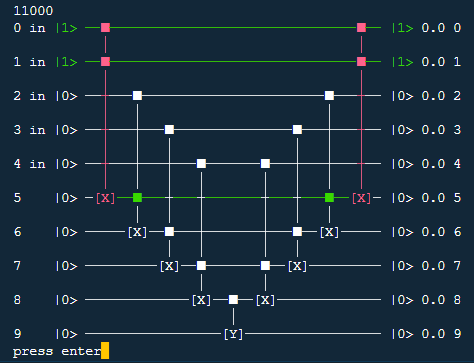
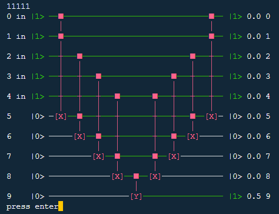

# quantestpy.assert_draw_pauli_circuit

## assert_draw_pauli_circuit(circuit, input_reg, input_binary_bitstring=[], draw_phase=False)

Prints out in stdout the colored circuit for all or optionally inputted initial values for the qubits in `input_reg`. Qubits in a state `|1>` are green-colored and the executed gates are red-colored.

### Parameters

#### circuit: quantestpy.PauliCircuit
The circuit to draw. [quantestpy.PauliCircuit](./pauli_circuit.md) is a circuit class developed in this project.

#### input_reg : list[int]
A list of qubit ids. The output of this method is the circuit(s) from all or optionally inputted initial state(s) for these qubits.

#### input_binary_bitstring : list[str], optional
A list of initial values for the qubit(s) in `input_reg`. If not given, all possible values are covered.

#### draw_phase : bool, optional
If True, a phase of a qubit is also printed out in unit of `PI` at the end of the circuit. If the phase is `e^{i\pi/2}` for instance, then `0.5` is shown.

### Examples


```py
from quantestpy import PauliCircuit, assert_draw_pauli_circuit

pc = PauliCircuit(10)
pc.add_gate({"name": "x", "target_qubit": [5], "control_qubit": [0, 1], "control_value": [1, 1]})
pc.add_gate({"name": "x", "target_qubit": [6], "control_qubit": [2, 5], "control_value": [1, 1]})
pc.add_gate({"name": "x", "target_qubit": [7], "control_qubit": [3, 6], "control_value": [1, 1]})
pc.add_gate({"name": "x", "target_qubit": [8], "control_qubit": [4, 7], "control_value": [1, 1]})
pc.add_gate({"name": "y", "target_qubit": [9], "control_qubit": [8], "control_value": [1]})
pc.add_gate({"name": "x", "target_qubit": [8], "control_qubit": [4, 7], "control_value": [1, 1]})
pc.add_gate({"name": "x", "target_qubit": [7], "control_qubit": [3, 6], "control_value": [1, 1]})
pc.add_gate({"name": "x", "target_qubit": [6], "control_qubit": [2, 5], "control_value": [1, 1]})
pc.add_gate({"name": "x", "target_qubit": [5], "control_qubit": [0, 1], "control_value": [1, 1]})

assert_draw_pauli_circuit(
    circuit=pc,
    input_reg=[0, 1, 2, 3, 4],
    input_binary_bitstring=["11000", "11111"],
    draw_phase=True
)
```


